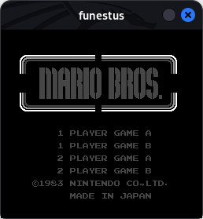
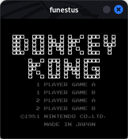
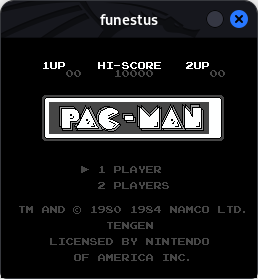

# funestus

In the future this should become a proper NES emulator. But for now, it is still in an early stage of development, that is, it is not playable. However, it is already possible to see some screens, albeit in shades of gray. Only the background is visible; the sprites still don't appear. At the moment only the simplest games can be loaded.

The SDL2 library was used in order to display pixels on the screen, due to the facility it offers in this regard. Installation instructions can be found on the project's website, but usually it can be installed via package managers.

This emulator prototype is being written in C language to run in Linux environment. Development was only possible due to the abundance of material found on the forums and wiki of NesDev, a community of NES-related application developers. Furthermore, CPU emulation took the help of the simulator found in Visual6502.

[https://www.nesdev.org/](https://www.nesdev.org/)  
[http://visual6502.org/](http://visual6502.org/)  
[https://www.libsdl.org/](https://www.libsdl.org/)  

